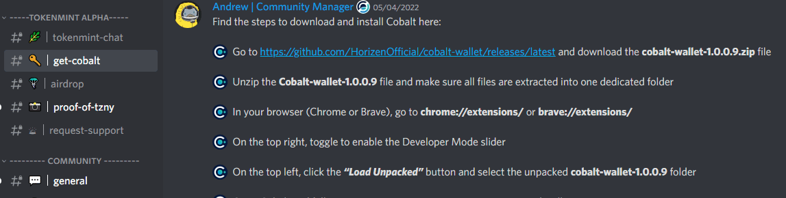

# Horizen SideChains Test
## Test Horizen’s TokenMint Platform and Cobalt Web Wallet on Testnet #51

Goals:

Test Horizen’s new TokenMint Platform and Cobalt web wallet on Testnet and document steps/findings. 

Here is the original call:
***********************************************************************************
HDE task

https://hde.horizen.io/task/1226982867
https://github.com/HorizenOfficial/HDE-Proposals/issues/51

Required steps:

- [x] Download Sphere by Horizen Testnet v1.3.0: 
https://github.com/HorizenOfficial/Sphere_by_Horizen_Testnet/releases/tag/desktop-v1.3.0-beta-testnet

- [x] Download Cobalt Wallet Testnet:
https://github.com/HorizenOfficial/cobalt-wallet/releases/latest

- [x] Obtain free test ZEN (tZEN) via the Horizen Early Adopter Program (HEAP): https://heap.horizen.global/ - sphere.

- [x] Obtain free test ZNY and ZEN via airdrop: https://discord.com/channels/334085157441110017/971428522306457610 - cobalt.

- [x] Obtain `Test Pilot` role

- [x] Perform a Forward Transfer from the mainchain to the sidechain.

- [x] Perform sidechain transfer

- [x] Perform a Backward Transfer from the sidechain to the mainchain.

- [x] Produce a detailed report that includes screenshots of the different steps.

For more info: https://hde.horizen.io/tasks
*************************************************************************************
### **Here we have all the steps explained:** ###
*Test is done on a Windows 10, **Brave browser**

First we need to download and install the sphere wallet and create account (always keep your **seed** phrase safe):

*Sphere wallet instalation was easy and smooth and the wallet is responsive with some interesting features.*

Next we should download and install Cobalt wallet. We have to enable `developer mode` in [Brave extensions](brave://extensions/) and `Load unpacked` content from Cobalt zip file. 
Create user wallet by following clear instructions from Cobalt extension (always keep your **seed** phrase safe).
[Here's complete user guide](https://blog.horizen.io/tokenmint-alpha-1-testnet-launch/)

After creating a wallet, share your new Cobalt wallet address on [Discord channel - airdrop](https://discord.com/channels/334085157441110017/971428522306457610) to receive tZNY and tZEN.
When received, share the transaction ID (better wallet) in the [Discord channel - proof-of-tzny](https://discord.com/channels/334085157441110017/971236179364167730) to receive `Test Pilot` role.

* [airdrop transactions - tokenmint](https://explorer-testnet.tokenmint.global/address/07d20f59d76c83531bf0e2d4bc4195871eac3672193cd1f59fedb18289a27277)

*Cobalt wallet is minimalistic and easy to use. Should have transactions better described with links to explorer.*

*TokenMint Explorer is very easy to use, fast and informative. It should have epochs data and main chain related data* 
*************************************************************************************
## Now we should try the transactions.
First we need test ZEN from the faucet. 
* [transaction from faucet 12 tZEN (sphere)](
https://explorer-testnet.horizen.io/tx/ce9df03cddd9ebce9f4757e298c6daa4cc2acca2b5501aa6fdc8d6ed2402977d)

Then we'll send 2 tZEN from sphere to cobalt.
It is important to choose the correct `sidechain option` from the send menu, when transfering to sidechain.

 
It took some time to show on sidechain, but eventually it did, below is the link.
* [transaction from sphere to cobalt wallet](https://explorer-testnet.horizen.io/tx/db505a88ba0e8f69da5acb5b13188e8f92c93185154cc35db34f0174b011c9d6)

Now we gonna try the transaction of 1 tZNY to another sidechain wallet: `e259c170f497cb266021d91b7eca983bf5bb32e8125c1fe2a76ed277021592d2`, and then 1 tZEN back to the main chain sphere wallet

Both transactions went through very smoothly, links are below:
* [transaction from cobalt TZNY](https://explorer-testnet.tokenmint.global/tx/fe08143b92400999399702619c809d5c41072b143ad2adf8dfa2d7d107a1ea8b)
* [transaction from cobalt TZEN - MintToken](https://explorer-testnet.tokenmint.global/tx/856d1ecd6d26068608f8d34bcc191306bb2d0250ef67353d0a47992764057fdd)

The last step is to wait for the confirmation from the main chain, ~3 days (2 epoch * 900 blocks)...

*There should be a way to track the status of this transaction in more details (like the number of the blocks left, or the timer maybe)*. 
*************************************************************************************

[And after xxxx confirmations on tokenmint sidechain the transaction finaly arrived to the mainnet:
* [confirmed transaction from cobalt TZEN on main testnet network](...)]

*************************************************************************************
discord_username
: |o0l0o|#7266

bounty_address
: znYvDEY1Wmu14kYe5RtWRpYhzTvJazsqp37
